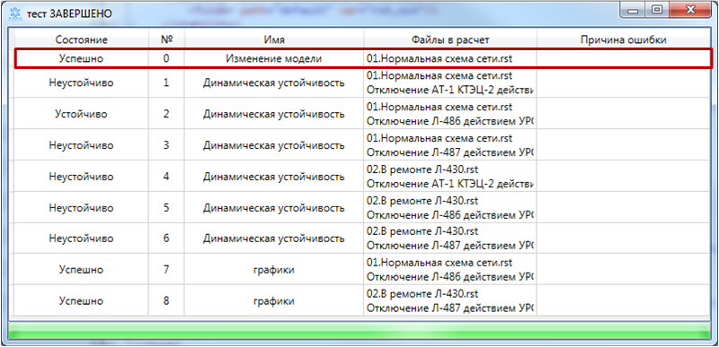
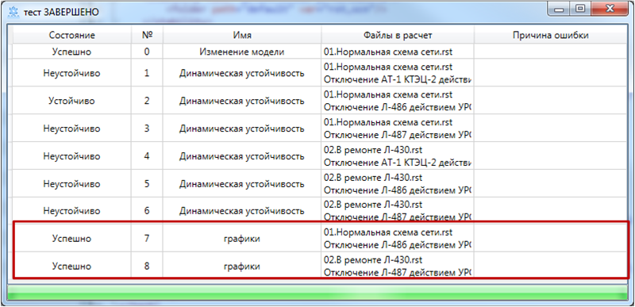

# Команды

Задание на расчет в программе состоит из более мелких структурных элементов - *команд*, которые описывают сущность выполняемой задачи, например, расчет динамической и статической устойчивости, построение графиков переходных процессов, поиск шунта, утяжеление режима и т.д. Таких команд в задании может быть неограниченно много (в разумных пределах). Шаблоны для задания команд находятся в контекстном меню текстового поля (правая кнопка мыши)

## Общая информация

**Элемент команды** обязательно состоит из следующих компонентов:
1. **Тег команды** - указывает программе на тип желаемого действия. На данный момент доступны следующие теги: 
   + `<stability>` - расчет динамической устойчивости
   + `<graph>` - вывод графиков переходных процессов
   + `<write>` - изменение расчетной модели   

Каждый тег, должен быть обязательно закрыт, то есть выглядеть так: `<stability>...</stability>`, либо, если вложенные элементы не требуются, то так: `</stability>`

В примере ниже `<stability>` - открывающий тег, `</stability>` - закрывающий тег для основного элемента, `<folder/>` - тег вложенного элемента, он является одновременно открывающим и закрывающим, так как сам не содержит вложенных элементов
```xml
<stability name="Динамическая устойчивость">
	<folder path="default" var="rst,scn"/>
</stability>
```

2. **Параметры команды** - указывают программе на исходные данные, необходимые в процессе выполнения. Делятся на:
   + обязательные - без указания этих параметров команда выполнятся не будет
   + необязательные - дополнительные исходные данные, без которых можно обойтись

Каждый параметр имеет имя и значение, они разделяются знаком `=`, а значение помещается в двойные кавычки, вот структура: `name="value"`. 

Пример: 
```xml
<write name="Изменение модели" table="node" column="uhom" selection="uhom=110" value="115">
	<file path="default\01.Нормальная схема сети.rst"/>
</write>
```
В этом примере параметрами команды **write** являются *table, column, selection, value*

3. **Вложенные элементы** - указывают программе на исходные данные, логика которых довольно сложна и ее невозможно описать простым параметром. По разметке отличий от элемента команды нет, они тоже должны закрываться, могут иметь параметры, вложенные элементы и т.д.

Пример: 
```xml
<graph name = "графики">
	<plot name="Напряжения">
		<curve name="ГРЭС-2" table="node" column="vras" selection="ny=1001"/>
		<curve name="ПС 330 кВ Звезда" table="node" column="vras" selection="ny=1193"/>
		<curve name="ТЭЦ-15" table="node" column="vras" selection="ny=1179"/>
	</plot>
	<files>
		<file path="default\02.В ремонте Л-430.rst"/>
		<file path="default\Отключение Л-487 действием УРОВ при К11 с отказом ВЛ-487.scn"/>
	</files>
</graph>
```
В этом примере вложенными элементами команды **write** являются **plot**, **files**. В свою очередь, элемент **plot** содержит 2 вложенных элемента **curve**, элемент **files** содержит 2 вложенных элемента **file**

## Способы задания файлов

Существует три способа задания файлов расчетной модели для команды, которые впоследствии попадут в расчет. Все они должны задаваться в виде вложенных элементов в основной элемент команды:
   + *file* - в расчет попадет один файл
   + *files* - в расчет попадет набор файлов
   + *folder* - в расчет попадут файлы, находящиеся в указанной папке
   
В каждом элементе команды может быть сколько угодно вложенных элементов с заданием файлов расчетной модели

### file
В расчет попадает один указанный файл

Имеет один параметр:
   + *path* - задает путь к нужному файлу

Не может иметь вложенных элементов

Пример:
```xml
<file path="default\02.В ремонте Л-326.rst"/>
```  
### files
В расчет попадает несколько указанных файлов

Не имеет параметров
Должен иметь вложенный элемент:
   + *file* - смысл и структура разметки аналогичная элементу *file*, описанному выше
   
В каждом элементе **files** может быть сколько угодно вложенных элементов **file**

Пример:
```xml
<files>
	<file path="default\01.Нормальная схема сети.rst"/>
	<file path="default\Отключение Л-441 действием УРОВ при К11 с отказом ВЛ-441.scn"/>
</files>
```  
### folder
В расчет попадает несколько файлов из указанной папки

Имеет два параметра
   + *path* - задает путь к нужной папке
   + *var* - указывает расширения файлов, которые должны попасть в расчет (через запятую)
   
Может иметь вложенный элемент

   + *file* - задает файл, попадающий в каждый расчет из указанной папки. Структура разметки аналогичная элементу *file*, описанному выше
   
В каждом элементе **folder** может быть сколько угодно вложенных элементов **file**

Пример:
```xml
<folder path="default" var="rst,scn">
	<file path="лапну.dwf"/>
</folder>
```  
**Все пути к файлам могут быть как полными, так и относительными**

## stability
#### Расчет динамической устойчивости
Производит простой расчет переходного процесса с проверкой на наличие динамической устойчивости

Имеет один параметр:
   + *name* - задает имя для команды
   + *time* - устанавливает время расчета переходного процесса. Необязательный параметр

Пример:
```xml
<stability name="Динамическая устойчивость">
	<folder path="default" var="rst,scn"/>
</stability>
```  
В результате в задание попадает расчет переходного процесса для всех файлов rst со всеми файлами scn попарно


## write
#### Изменение расчетной модели
Записывает в таблицы RastrWIN значение по выборке, пересохраняет файлы расчетной модели

Параметры:
   + *name* - задает имя для команды
   + *table* - указывает таблицу
   + *column* - указывает столбец
   + *selection* - описывает выборку строк
   + *value* - задает новое значение
   
Пример:
```xml
<write name="Изменение модели"	table="node" column="uhom" selection="uhom=110"	value="115">
	<file path="default\01.Нормальная схема сети.rst"/>
</write>
```  
В результате в задании будет выполнено изменение расчетной модели в файле "01.Нормальная схема сети.rst" в подпапке "default": для всех узлов с номинальным напряжением 110 кВ будет задано номинальное напряжение 115 кВ



## graph
#### Вывод графиков переходного процесса

Параметры:
   + *name* - задает имя для команды
   + *time* - устанавливает время расчета переходного процесса. Необязательный параметр
   
Вложенный элемент:
   + *plot* - описывает формат графика
   
Параметры элемента **plot**:
   + *name* - задает имя для команды
   
Вложенные элементы **plot**: 
   + *curve* - описывает формат кривой
   
Параметры элемента **curve**:  
   + *name* - задает имя кривой
   + *table* - указывает таблицу
   + *column* - указывает столбец
   + *selection* - описывает выборку строк, если несколько строк попало в выборку, берет первую
   
Пример:
```xml
<graph name="графики" time="12">
	<!--- Описание графиков -->
	<plot name="Напряжения">
		<curve name="ГРЭС-2" table="node" column="vras" selection="ny=1001"/>
		<curve name="ПС 330 кВ Звезда" table="node" column="vras" selection="ny=1193"/>
		<curve name="ТЭЦ-15" table="node" column="vras" selection="ny=1179"/>
	</plot>
	<plot name="Углы роторов">
		<curve name="ГРЭС-2" table="Generator" column="Delta" selection="Num=116"/>
		<curve name="ТЭЦ-15" table="Generator" column="Delta" selection="Num=108"/>
	</plot>
	<!--- Описание наборов файлов, попадающих в расчет -->		
	<files>
		<file path="default\01.Нормальная схема сети.rst"/>
		<file path="default\Отключение Л-486 действием УРОВ при К11 с отказом ВЛ-486.scn"/>
	</files>
	<files>
		<file path="default\02.В ремонте Л-430.rst"/>
		<file path="default\Отключение Л-487 действием УРОВ при К11 с отказом ВЛ-487.scn"/>
	</files>
</graph>
```  
В результате в задание попадет два расчета переходного процесса с выводом графиков:

1. Для файла динамики "01.Нормальная схема сети.rst" со сценарием "Отключение Л-486 действием УРОВ при К11 с отказом ВЛ-486.scn"
2. Для файла динамики "02.В ремонте Л-430.rst" со сценарием "Отключение Л-487 действием УРОВ при К11 с отказом ВЛ-487.scn"



Выведено будет 2 графика (открываются по двойному клику):
1. График "Напряжения" с тремя кривыми напряжения для узлов 1001, 1193 и 1179
1. График "Углы роторов" с двумя кривыми углов для генераторов 116 и 108


Масштабирование графика осуществляется колесиком мыши (прокрутка - изменение масштаба, протягивание - просмотр диапазона, двойной клик - масштаб по умолчанию). Перемещение с зажатой правой кнопкой мыши
