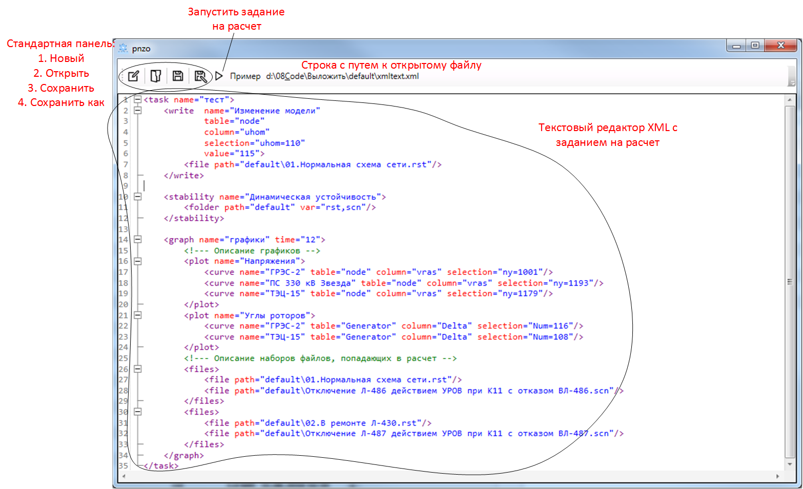

# Начало работы

Для того, чтобы запустить программу и начать работать, в принципе, ничего особенного не требуется.
<br>Главное условие - установленный RastrWIN, очень желательно самой последней версии, так как все тестируется именно на последних библиотеках Astra.dll

## <a name="interface"></a>Внешний вид
Главное окно программы


Основные элементы:

1. **Панель с кнопками:**
   + *Новый* - очищает текстовое поле и создает шаблон для нового задания
   + *Открыть* - появляется диалоговое окно с предложением открыть существующий xml-файл с заданием
   + *Сохранить* - сохраняет содержимое текстового поля в текущий открытый файл
   + *Сохранить как* - появляется диалоговое окно с предложением сохранить содержимое текстового поля в новый xml-файл
   + *Запустить* - если задание задано правильно, запускается поток выполнения задания, открывается соответствующее окно с краткой информацией
   + *Пример* - открывается файл с уже собранным заданием, для облегчения понимания и тестирования программы
   
1. **Текстовое поле** - представляет собой простейший текстовый редактор с подсветкой [xml разметки](https://ru.wikipedia.org/wiki/XML). Задание на расчет формируется в этом поле

## <a name="markdown"></a>Разметка
Информация о типе поставленной задачи и параметрах расчетов, пути к файлам расчетных моделей и т.д. задаются в программу с помощью xml-файла со следующей структурой:
```xml
<task name="Имя задания">
  <command1 param1="value1" param2="value2">
  ...
  </command1>
  <command2 param1="value1" param2="value2">
  ...
  </command2>
</task>
```

Подробно прочитать про xml разметку можно [здесь](https://ru.wikipedia.org/wiki/XML). Для максимального воспрятия того, зачем это все нужно, лучше всего нажать на кнопку "Пример" на главном окне программы и далее ознакомиться с разделом Команды
